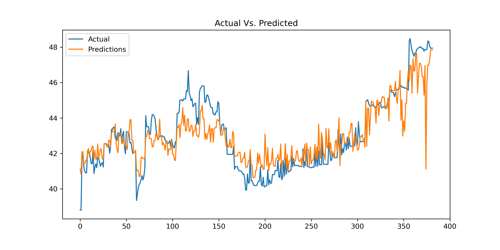

# ml-apple-health-vo2max
A project inspecting my Apple Health Data, particularly trying to predict Vo2Max based on workouts.
> Export your own data with [qs_ledger](https://github.com/markwk/qs_ledger/blob/master/apple_health/apple-health-data-parser.py).  The exporter was a huge help getting my data in a format ammenable to machine learning.
## The Goal
Predict Vo2Max with the highest fedelity given a few hundred datapoints of actual Health workout datapoints.

## The Process
A brief summary of the proceedure is:

1. Load and split data into 3 sets
2. Use RandomizedSearchCV to select a model family
3. Use GridSearchCV to tune hyperparameters of selected model family
4. Fit final model and visualize against actual data

## Results

# Findings, Conclusions, and Future Work
**Findings**:
* The measurement of Vo2Max is not a trivial measurement, or a model would have been able to easily fit
    * Thus the measurement my Apple Watch does to approximate my Vo2Max is (probably) not trivial
    * The actual calculation is proprietary, so I'm glad to know that it is not trivial to reverse
    * Which means that there is _actual value in the Apple Watch's Vo2Max calculation_
* My original models were not the issue
    * I originally only used 'duration', 'totalDistance', and 'totalEnergyBurned'
    * This was not enough for a good prediction, as anything outside of training was pretty bad
    * I wasted a lot of time trying to get the model to do something the data wouldn't allow
    * RandomizedSearchCV is a great tool to get a pretty good impression of the performance the data will allow you to achieve
* I also wasted time playing the lottery
    * By that I mean, I spent too much time doing manual hyperparameter tuning thinking I may hit some magic jackpot of hyperparameter values
    * Of course, I never did, and I only wasted time in the process
    * The short feedback loop of fitting and performance can be addicting, but it is unproductive.
* Looks arn't everything
    * I like to visualize the model so I can catch things that may be obvious on a plot
    * However, complex plots can be hard to accumulate errors visually
    * Thus MSE, and MAE fill that spot of discrete values.
    * I had two prediction plots, one with a flat line vs a quite jagged line that seemed to follow the trend, but unfortunately, the flat line gave a better prediction per MSE and MAE.

**Conclusions**:
* Don't waste time  
    * Know when the models are maxed out, and solve the underlying problem 
* Think about the underlying problems
    * Why isn't your model performing as you wish? Maybe the solution is not to train *longer* but to be *smarter*.
* Therefore, use every tool available
    * MSE is a tool, plotting is a tool, RandomizedSearchCV is a tool
* Don't Give Up
    * I really thought there was nothing to be found in this project, but turns out there was a lot to learn.

**Future Work**
* I originally set out to determine if I could use my workouts to predict my Vo2Max, and help myself understand which actions to take to live a healthier lifestyle.  What I think I've shown to some degree is the validity of the Vo2Max measurement from the Watch.
* With more time and energy, I'd like to look at more exogenous variables to see if somehow steps per day, or stand hours per day, or previous week of workouts contribute significantly to the increase of Vo2Max measure and in turn health.
    